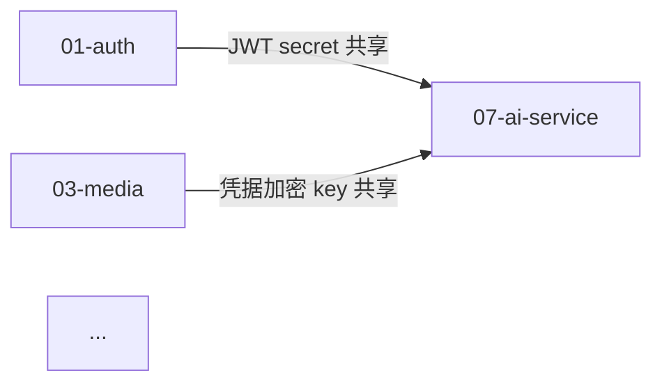

# Project Audit Pipeline — 项目技术摸底沉淀工作流

> 把"读不完的项目"转化为"读得完、改得动、回得来"的技术文档树。
>
> 核心理念:**主代理只做协调与整合,具体阅读交给并行子代理;每条产出都同时写到分层文档和迭代变更日志,绝不让发现散落在对话里。**

---

## 0 · 适用场景

**适合:**
- 中大型 monorepo / 多语言多服务的项目(后端 + 前端 + AI + 基础设施)
- 接手一份不熟悉的代码、需要在 1 个会话内建立"心智地图"
- 准备技术评审 / 安全审计 / 大型重构,需要一份结构化基线
- 团队入职文档基础建设

**不适合(请用其他 skill):**
- 单文件 / 单模块的小修小补 — 直接读源码即可
- 已经有完善 docs 的项目里再做一次摸底 — 先 diff 现有 docs,再决定是否重做
- 仅 review 一个 PR — 用 code-review skill

**触发短语示例:**
- "对项目进行技术摸底" / "全模块拆解沉淀"
- "我想要一份完整的技术文档" / "项目梳理一下"
- "摸底归档" / "技术调研"
- "目前完成的功能都有什么,系统化整理"

---

## 1 · 核心理念

### 1.1 四层渐进文档结构

任何项目都按四层来沉淀,不要塞进一个文件:

```
Layer 1  功能目录          顶层目录(01-* ~ NN-*)按"业务/技术职责"分组
Layer 2  总体设计模块       每个模块的 README.md  ——  边界 / 架构图 / 子能力清单 / 关键决策
Layer 3  能力设计           每个模块下的 0X-能力名.md  ——  责任范围 / 入口 / 数据流 / 配置 / 已知限制 / 测试
Layer 4  迭代变更摘要       CHANGELOG.md  ——  每次产出/修订的摘要 + 非显然发现 + 跨模块溢出
```

**为什么是这四层 ——** 任何技术文档至少回答四个问题:**整体长什么样(L2)、具体怎么做的(L3)、为什么要这么做(L2 关键决策)、最近发生了什么(L4)**。L1 只是分类承载。

### 1.2 主代理 + 并行子代理工作流

| 角色 | 职责 | 工具 |
| --- | --- | --- |
| **主代理(协调者)** | 侦察、骨架、分配、整合、横向矩阵、收尾 | Bash/Glob/Read/Write/Edit/TodoWrite/Agent |
| **子代理(深耕者)** | 各自负责一个模块,深读源码,产出该模块全部文档,回报非显然发现 | general-purpose,可读可写 |

**关键纪律:**
- 子代理必须用 `general-purpose` 类型(可写文件);Explore/Plan 类型不能写。
- 子代理之间**绝不共享上下文**(每个独立),靠 prompt 自包含。
- 子代理的产出**直接落盘**到自己模块目录,而不是返回给主代理再写 — 避免主代理上下文爆炸。
- 主代理只接收 200-400 字的回报摘要,把摘要写进 CHANGELOG。

### 1.3 横向矩阵聚合(关键差异化产出)

10 份独立模块文档之上,主代理必须做一次"全局视角聚合":
- **P0/P1 问题表**(去重) — 把每个模块的"非显然发现"汇总
- **跨模块耦合"对子"表** — 改 A 必须同步改 B 的强约束清单
- **角色化阅读路径** — 新人 / 加功能 / 排查事故 / 安全审计

> **没有横向矩阵的摸底 = 把"读不完"换成"读不出问题"**。这个聚合是 skill 的核心价值,**不可省略**。

### 1.4 全程纪律(写在前面,后面照做)

- ✅ **侦察先行,绝不空猜** — 用 ls/find/wc 先把项目轮廓量化,模块拆分要有证据。
- ✅ **CHANGELOG 实时增量** — 每个子代理回报立即写入,绝不堆积;堆积 = 遗忘。
- ✅ **代码引用全部 `path/file.ext:line` 格式** — 让读者一键跳转。
- ✅ **"未实现"显式标注** — 看到名字像功能但实际没接通的(死路)必须明说。
- ✅ **主代理不重复子代理工作** — 避免在主线程做模块级深读。
- ❌ **不写 emoji**(除非引自源码或用户明确要求)。
- ❌ **不让子代理跑 git/pnpm/docker/curl** — 只读,避免副作用。
- ❌ **顶层 README 不在 Wave 1 时写** — 必须等所有模块沉淀完才能聚合。

---

## 2 · Phase 0:准备

### 2.1 触发后的第一件事

打招呼 + 一句话确认你理解了任务:
> "我会按照「主代理 + N 并行子代理 + 四层文档 + 横向矩阵」工作流来沉淀整个项目。先做侦察,再分配代理,最后整合。"

### 2.2 必读项目上下文

按存在性优先读取(并行 Bash):
1. `CLAUDE.md`(项目级 agent 指令)— 必读
2. 顶层 `README.md` / `AGENTS.md`
3. 任何已有的 `docs/architecture.md` / `系统需求企划书*.md`
4. `package.json` / `go.mod` / `pyproject.toml` / `Cargo.toml`(技术栈)
5. `docker-compose*.yml`(服务拓扑)
6. `.env.example`(配置面)

**不要逐字读完**,只看到能定位"项目是什么、用了什么、有几个 app"即可。

### 2.3 加载工具

通过 `ToolSearch` 加载本 skill 必需的工具(如果尚未加载):
- `TodoWrite` — 跟踪进度
- 如有需要:`Glob` / `WebFetch` / `WebSearch`

---

## 3 · Phase 1:项目侦察 + 模块拆分

### 3.1 侦察命令(并行执行)

```bash
# 顶层结构
ls -la <project_root>
ls <apps_or_packages_root> 2>/dev/null
# 服务/应用列表
find . -maxdepth 3 -name "package.json" -not -path "*/node_modules/*" 2>/dev/null
find . -maxdepth 3 \( -name "go.mod" -o -name "pyproject.toml" \) 2>/dev/null
# 后端关键路径(按语言适配)
ls <backend>/internal/handler /service /repository /model /middleware 2>/dev/null
ls <backend>/migrations 2>/dev/null | tail -20
# 前端
ls <frontend>/app /src 2>/dev/null
# 文档与基础设施
ls docs/ .github/ ops/ nginx/ scripts/ 2>/dev/null
```

> 所有 `ls` / `find` 一律带 `2>/dev/null` —— 项目结构未必符合假设,目录缺失只想留空输出,不要让错误信息污染 agent 的解析视图。`find` 的 `-name a -o -name b` 没用括号会让前一个 expression 的 `-not -path` 失效,务必用 `\( ... \)` 包起来。

**目标:** 在不超过 8 个并行 Bash 调用内,得到:
- 顶层目录树
- 各 app/service 的路径
- handler / page / migration 数量级
- 已有 docs 列表

### 3.2 模块拆分启发式

经验法则:**3 ≤ 模块数 ≤ 12**(并行子代理硬上限通常是 10)。

按以下信号分模块:

1. **物理边界优先** — 不同 app / service / language runtime → 各自一个模块
2. **业务垂直域** — 同一后端内,把"用户/内容/媒体/AI/搜索/系统"按职责切片
3. **技术横切层** — 数据库 schema、设计系统、基础设施作为独立模块
4. **共享代码** — `packages/*` 作为独立模块或并入设计系统模块

**典型拆分模板(全栈 web 应用,10 模块):**

```
01-backend-auth-users         鉴权 / 用户 / 权限
02-backend-content            核心业务实体 1(如内容管理)
03-backend-domain-X           核心业务实体 2(如媒体/订单等)
04-backend-system-misc        AI / 搜索 / 监控 / 杂项 + 中间件
05-frontend-public            面向终端用户的前端
06-frontend-admin             管理后台
07-service-extra              辅助 service(AI / worker / job)
08-database-migrations        DB schema + migration history
09-design-and-shared          设计系统 + shared packages
10-infra-devops               Docker / Nginx / CI / scripts
```

**调整规则:**
- 如果某模块代码量 > 平均 2 倍,**拆开**(如 admin 太大可拆成 admin-content + admin-config)
- 如果某模块代码量 < 平均 1/3,**合并**到相邻模块
- 单个模块预期产出 6-9 份能力文档,< 4 个能力 = 模块太小,> 10 = 模块太大

### 3.3 把拆分方案告诉用户

在派遣代理前,**必须**给用户看一张拆分表(模块编号 / 名称 / 关注面 / 输入路径)。这是"绝不偏差"的关键 — 用户可纠正模块边界。

---

## 4 · Phase 2:骨架搭建

### 4.1 创建目录结构

```bash
mkdir -p docs/output/{01-mod-name,02-mod-name,...,NN-mod-name}
```

输出根目录默认 `docs/output/`。如果项目已有 `docs/` 目录,**强烈建议**新建 `output/` 子目录避免污染既有 docs。

### 4.2 初始化 CHANGELOG.md(立即写)

```markdown
# <项目名> · 技术摸底沉淀 · 迭代变更日志

> 本文件以摘要形式记录 `docs/output/` 中每一次文档沉淀的迭代变更。
> 每条记录包含:**触发事件 · 影响范围 · 文档增量 · 关键发现 · 跨模块溢出**。
>
> 版本基线:<YYYY-MM-DD> / branch <branch> / migrations 至 <NNN> / <其他基线信号>。

---

## 目录结构约定

(贴出 docs/output 树)

## 迭代记录

### Iteration 0 · <YYYY-MM-DD> · 骨架初始化

**触发事件:** 用户要求 ...

**影响范围:** docs/output/ 整树。

**文档增量:** 创建 N 个模块目录、CHANGELOG.md、README.md 占位。

**关键发现:**(此时只有侦察事实)

**下一步:** Wave 1 — 并行 N 个子代理沉淀各模块。
```

### 4.3 初始化顶层 README.md(占位)

只写"骨架已立、Wave 1 后填充"。**禁止**此时写架构图与横向矩阵 — 信息不全的聚合是负价值。

---

## 5 · Phase 3:Wave 1 — 并行子代理派遣

### 5.1 子代理 Prompt 通用模板

每个子代理 prompt 由 **共同部分 + 模块特定部分** 拼成。下面这块**完整可拷贝**,只需替换 `<...>` 占位:

```
你是 <项目名> 项目「<模块名>」模块的技术摸底文档作者。

# 项目背景
- <项目一句话定位>
- 技术栈: <一行罗列>
- 工作目录(绝对路径): <ABSOLUTE_PATH>
- 输出语言: <中文 / 英文 / 跟随项目>
- 输出根目录: docs/output/<NN-module-slug>/

# 模块范围(必读)
<列出本模块的所有源码文件 / 目录,使用相对路径>

(如果有跨模块的小段重叠,在这里明确"重点描述 / 仅引用 / 不要重复")

# 任务输出(全部写到 docs/output/<NN-module-slug>/)

1. **README.md** —— 总体设计
   必含章节: 模块定位 / 边界与职责 / 架构图(ASCII) / 子模块清单(指向各能力文档) /
            横向依赖(被谁调/调谁) / 关键决策记录 / 技术栈与库版本 / 已知问题清单 / 扩展点

2. **01-<capability>.md** —— <能力 1>
3. **02-<capability>.md** —— <能力 2>
... (按模块特性列 4-9 份)

# 每个能力文档必含
- 责任范围
- 关键代码入口(file_path:line_start-line_end + 函数名)
- 数据流(请求 → middleware → handler → service → repo → DB,具体到方法名)
- 涉及的 DB 表 / 字段 / 索引(若涉及)
- 配置 / 环境变量 / Redis key / 第三方依赖
- 与其他模块耦合
- 已知限制 / 待改进
- 测试覆盖说明(列出对应 *_test 文件覆盖了什么)

# 要求
- markdown 用 # / ## / ### 干净分级
- 文件引用格式: `path/to/file.ext:42-58`
- 不写 emoji(除非引自源码)
- 每个文档 200-500 行(完整性 > 简洁;模块巨大时 README 可超 500)
- 不要执行 git/pnpm/docker/curl 等副作用命令
- 不要写到 docs/output/<NN-module-slug>/ 之外
- Glob/Grep/Read 大胆并行,加速侦察
- "看似存在但实际未实现"的能力(空 handler / 死代码 / 配置未生效)必须显式标注
- 不确定的地方就描述你观察到的事实,不要瞎猜

# 报告
完成后用 200-300 字回复:
1) 写了哪些文件 / 对应能力
2) 1-3 条**非显然**发现(架构怪味、隐性 bug、技术债、命名漂移、半实现功能)
3) 你看到的、本模块**未覆盖但本应覆盖**的部分(应该归到哪个其他模块)
```

### 5.2 派遣纪律

- **同一消息内多个 Agent 调用** — 真正并行(不要串行 await)
- **`run_in_background: true`** — 让代理后台跑,主代理不阻塞
- **每个代理都用 `general-purpose` 类型** — 不要用 Explore(只读)
- **`isolation` 不要设 worktree** — 必须落盘到当前工作目录
- **不要超过 10 个并行**(Claude Code 默认限制)— 模块多就分两波

### 5.3 等待与回报

- 代理完成会收到 `<task-notification>` 通知
- **每收到一条立即更新 CHANGELOG**(下一节模板),不堆积
- 在等待间隙不要乱做事 — 不要主线程深读源码,避免重复劳动

---

## 6 · Phase 4:Wave 2 — 整合与横向矩阵

### 6.1 CHANGELOG 增量条目模板(每代理回报后立即追加)

```markdown
### Iteration 1.NN · <YYYY-MM-DD> · <模块名>(模块 NN 完成)

**触发事件:** 子代理 #N 完成 `docs/output/<NN-mod-slug>/`。

**影响范围:** 模块 NN 共 X 个文档,合计 ~YYYY 行。

**文档增量:**
- `README.md`(NNN 行) —— <一句话概括>
- `01-xxx.md`(NNN 行) —— <一句话概括>
... (逐文一行)

**关键发现(非显然):**
1. **<发现标题>** —— <一句话事实> + <一句话影响>
2. **<发现标题>** —— ...
3. **<发现标题>** —— ...

**跨模块溢出:**
- <溢出项> → 应被 **<NN-other-module>** 收录
- ...
```

### 6.2 等所有模块完成后:写顶层 README

#### 6.2.1 必含章节(按顺序)

```
1 · 文档分层(图示四层)
2 · 模块导航(分类表格,每行:编号/模块/关注面/文档量)
3 · 全局架构速览(ASCII 拓扑图 + 数据/服务总线说明)
4 · 横向矩阵
   4.1 P0/P1 问题表(去重 — 跨模块同一问题只列一次)
   4.2 跨模块耦合"对子"表
5 · 阅读路径建议(角色化 — 新人/加功能/排查事故/安全审计)
6 · 沉淀方法论(本次产出怎么做的,留作团队后续参考)
7 · 后续维护建议(PR 触发对子提示 / 新增能力同步 README + CHANGELOG / 季度巡检)
```

#### 6.2.2 P0/P1 问题表的萃取规则

逐个读 10 个 CHANGELOG iteration 段的"关键发现",按下表归类:

| 优先级 | 判定 |
| --- | --- |
| **P0** | 生产已经/即将出错;数据丢失/泄露/越权风险;用户操作完全失效 |
| **P1** | 影响重大功能可用性;违反项目铁律(CLAUDE.md);命名/规范偏差导致后续维护困难 |
| **P2**(可选) | 性能瓶颈;非关键路径技术债;清理/简化机会 |

P2 在文档量大时可省略 — 只保留 P0/P1 让读者聚焦。

#### 6.2.3 跨模块耦合"对子"表的萃取规则

把每个模块"溢出建议"中"X 改时必须同步 Y"型陈述聚到一张表:

| 触发改动 | 必须同步 | 文件锚点 |
| --- | --- | --- |
| <X> | <Y> | <docs/output/path-to-anchor> |

判定标准:**真正的强耦合**才入表(改 A 不同步 B 会立刻坏掉的)。一般依赖、文档参考不入。

#### 6.2.4 ASCII 架构图的最小要素

- 所有 app / service 一个方块
- 用户入口(网关 / CDN)在最上
- 数据库 / 缓存 / 对象存储在最下
- 关键端口 / 协议(HTTP/SSE/JWT)标在线上
- 跨进程共享 secret / 共享卷在图下方文字说明

### 6.3 写完顶层 README 后追加 Iteration 2 到 CHANGELOG

```markdown
### Iteration 2 · <YYYY-MM-DD> · Wave 2 整合

**触发事件:** N 个子代理全部沉淀完成,主代理整合 + 顶层 README + 横向矩阵。

**影响范围:** 顶层 README.md 全文重写。

**文档增量:**
- §1 文档分层
- §2 模块导航
- §3 全局架构速览(ASCII)
- §4.1 P0/P1 问题表(N 条)
- §4.2 跨模块耦合"对子"表(N 组)
- §5 阅读路径建议
- §6 沉淀方法论
- §7 后续维护建议

**数据沉淀总量:** N 个模块 / NN 份 markdown / NNNNN 行。

**关键产出洞察:**(主代理对全局的总结性观察 — 1-3 条)

**下一步(Wave 3):** 校核覆盖盲区,确认手册级文档完整。
```

---

## 7 · Phase 5:Wave 3 — 覆盖盲区校核(收尾)

### 7.1 覆盖审计(并行 Bash)

针对项目元素,逐项确认每个都映射到了某个模块:

```bash
# 后端 handler 全集
ls <backend>/internal/handler/*.go 2>/dev/null | grep -v _test
# DTO 全集
ls <backend>/internal/dto/ 2>/dev/null
# Repo / Service / Model 全集
ls <backend>/internal/{repository,service,model}/ 2>/dev/null
# Migrations 全集
ls <backend>/migrations/ 2>/dev/null | wc -l
# Frontend 页面 / 路由全集
find <frontend>/app -maxdepth 3 -type d 2>/dev/null
find <frontend>/src/pages -maxdepth 2 -type d 2>/dev/null
# 共享包
ls packages/ 2>/dev/null
```

把数量与文档中的覆盖做对照。任何元素**没被任何模块文档提到** = 盲区。

### 7.2 写收尾 Iteration 3 到 CHANGELOG

```markdown
### Iteration 3 · <YYYY-MM-DD> · Wave 3 覆盖盲区校核(收尾)

**触发事件:** 主代理对 N 模块沉淀做交叉审计,确认无重大盲区。

**审计结果:**

| 维度 | 数量 | 覆盖状态 |
| --- | --- | --- |
| <类别> | NN | <说明覆盖到哪些模块,或"全部交叉引用">|
| ... | ... | ... |

**未独立成章但已交叉引用的边缘内容:**
- <项> —— <理由>(如:体量小,合并入 X 模块更合理)

**最终交付指标:**
- 文件数:N 份
- 行数:NNNNN 行
- P0/P1:N + N 条
- 跨模块耦合:N 组

**结束条件已满足:** 项目从「四层渐进结构」完整拆解、交叉审计、横向矩阵聚合,沉淀完成。
```

### 7.3 真正可以收手的判定

**全部满足才能宣告完成:**
- ✅ 每个模块有 `README.md` 并包含 §1.1 中要求的所有章节
- ✅ 每个模块有 ≥ 4 份能力文档,各满足 §5.1 必含字段
- ✅ 顶层 `README.md` 含横向矩阵(P0/P1 + 对子表)
- ✅ `CHANGELOG.md` 有 Iter 0 / 每模块 1.0X / Iter 2 / Iter 3 共 N+3 段
- ✅ 覆盖审计无悬空元素(或悬空元素已说明)

---

## 8 · 文档模板

### 8.1 模块 README.md(总体设计)模板

```markdown
# 模块 NN · <模块名>

> <一句话定位:这个模块在系统中扮演什么角色>

## 1 · 模块定位

<2-3 段:边界、职责范围、不做什么>

## 2 · 架构图

\```
<ASCII 图:本模块内部组件 + 与其他模块的交互入口>
\```

## 3 · 子能力清单

| # | 能力 | 文档 | 主要入口 |
| --- | --- | --- | --- |
| 01 | <名> | [01-xxx.md](./01-xxx.md) | `path/file.ext` |
| ... | ... | ... | ... |

## 4 · 横向依赖

- **被以下模块调用:** <NN-X / NN-Y>
- **调用以下模块:** <NN-Z>
- **共享 secret / 资源:** <列出>

## 5 · 关键决策记录(ADR-style)

### 5.1 <决策标题>
- **背景:** ...
- **决策:** ...
- **代价:** ...

(每条决策一节;通常 3-7 条;**不要复述代码,只记录"为什么这么选"**)

## 6 · 技术栈与库版本

| 类别 | 选择 | 版本 |
| --- | --- | --- |
| <语言/框架/库> | <选择> | <版本> |

## 7 · 已知问题清单

| 优先级 | 问题 | 影响 | 建议 |
| --- | --- | --- | --- |
| P0 | ... | ... | ... |
| P1 | ... | ... | ... |

## 8 · 扩展点

- <未来增强的明确切入点,代码侧注释或 TODO>

## 9 · 与其他模块的交叉引用

- 本模块 X 由 [NN-Y/0Z-aaa.md] 详细描述,这里仅引用
- 跨模块耦合"对子":见顶层 [README.md §4.2](../README.md#42-跨模块耦合对子表)
```

### 8.2 能力设计 0X-*.md 模板

```markdown
# 能力 NN.0X · <能力名>

> <一句话:这个能力解决什么问题>

## 1 · 责任范围

- **In scope:** ...
- **Out of scope:** ...(明确边界)

## 2 · 关键代码入口

| 层 | 文件 | 关键函数 / 行号 |
| --- | --- | --- |
| Handler | `path/x_handler.go:42-78` | `HandleXxx` |
| Service | `path/x_service.go:120-180` | `XxxService.DoIt` |
| Repo | `path/x_repo.go:15-60` | `XxxRepo.FindByX` |
| Model | `path/x.go:1-30` | `Xxx` |

## 3 · 数据流

\```
请求 → middleware A → handler.HandleXxx
       → service.DoIt
         → repo.FindByX → DB query
         → 第三方调用 / Redis / 其他模块
       → 响应序列化
\```

## 4 · 数据模型 / 表关联

| 表 / 集合 | 关键字段 | 索引 / 约束 | 关联 |
| --- | --- | --- | --- |
| <table> | ... | ... | ... |

## 5 · 配置与依赖

- 环境变量: `XXX_YYY`(默认 ...)
- Redis key: `prefix:{user_id}`(TTL ...)
- 第三方: <服务名 + 接口>

## 6 · 已知限制 / 待改进

- <事实型描述,不要鸡汤>

## 7 · 测试覆盖

| 文件 | 覆盖范围 |
| --- | --- |
| `xxx_test.go` | 单元: A / B / C;集成: 无 |

(如果完全无测试,**显式写"测试覆盖率 0"**,不要含糊。)

## 8 · 与其他模块耦合

- 改 X 时同步 Y:见顶层 [README.md §4.2](../../README.md#42-)
```

### 8.3 横向矩阵 §4.1 P0/P1 表模板

```markdown
| 优先级 | 模块 | 问题 | 一句话影响 |
| --- | --- | --- | --- |
| P0 | <NN-mod> | <短标题> | <一句话:用户/数据/钱受影响的方式> |
| P1 | <NN-mod> | <短标题> | <一句话:可用性/规范/维护性受影响的方式> |
```

### 8.4 横向矩阵 §4.2 对子表模板

```markdown
| 触发改动 | 必须同步 | 文件锚点 |
| --- | --- | --- |
| <改 X 路由> | <改 nginx 配置 / DB schema / 前端 hook> | [NN-mod/0X-xxx.md](./NN-mod/0X-xxx.md) |
```

---

## 9 · 质量门 / Quality Gates

每份产出完成后,**机械性检查**(子代理已自查 + 主代理抽查):

### 9.1 文件级检查

- [ ] markdown heading 干净分级(无跳级 ## → ####)
- [ ] 至少 5 处 `path:line` 形式的代码引用
- [ ] 至少 1 张图(ASCII / mermaid)
- [ ] 200 行 ≤ 文件长度 ≤ 600 行(README 和巨型能力可放宽)
- [ ] 无 emoji(除引自源码)
- [ ] 不含 placeholder / TODO / "待补充"等悬空记号

### 9.2 模块级检查

- [ ] 模块下有且只有一个 `README.md`
- [ ] ≥ 4 份能力文档
- [ ] README 含 §1-§9 全部章节
- [ ] 有"已知问题清单"且至少 1 条
- [ ] 有"关键决策记录"且至少 3 条

### 9.3 全局级检查

- [ ] 顶层 README 横向矩阵完整(P0/P1 + 对子表)
- [ ] CHANGELOG 含 Iter 0 / 1.0X * N / 2 / 3
- [ ] 全部 N 个模块有产出(无空目录)
- [ ] 覆盖审计每行"覆盖状态"非空

主代理一键自查命令(改 N 与路径):
```bash
cd <project_root>/docs/output && \
for d in 0*-*; do
  echo "=== $d ===";
  count=$(ls "$d"/*.md 2>/dev/null | wc -l);
  total=$(wc -l "$d"/*.md 2>/dev/null | tail -1 | awk '{print $1}');
  echo "files=$count lines=$total";
done
```

---

## 10 · 反模式与陷阱

### 10.1 反模式

- ❌ **主代理亲自深读所有源码** — 浪费上下文,本来就该子代理做。
- ❌ **子代理之间对话** — Claude Code 不支持代理间通信;只能通过主代理串联。
- ❌ **顶层 README 在 Wave 1 阶段就写细节** — 信息不全,只能写占位。
- ❌ **CHANGELOG 等全部完成再一次性写** — 漏发现的概率极高。
- ❌ **代理回报全文 dump 到 CHANGELOG** — 必须摘要为 200-300 字。
- ❌ **所有模块用同一 prompt** — 每个模块必须列出自己的"必读文件路径",不能笼统。
- ❌ **"已知问题"全是性能优化空话** — 必须基于代码事实,引用 `path:line`。
- ❌ **跨模块溢出无人收拢** — 如果代理 A 说"应该被 B 模块覆盖",主代理必须确认 B 真的覆盖了或显式认领为不需要覆盖。

### 10.2 常见陷阱

- 🪤 **代理超时 / 报错 / 偏离** — 重派同名 prompt 即可;新代理是新会话不会带偏。
- 🪤 **同一概念命名漂移**(用户/User/账号 等) — 在主代理 prompt 里给一个简短术语表。
- 🪤 **代理把多份文档塞到一个文件** — prompt 必须明确"分文件输出",并列出全部目标路径。
- 🪤 **代理触碰其他模块文件** — prompt 末尾强调"不要写到 docs/output/<本模块>/ 之外"。
- 🪤 **巨型 monorepo 单代理读不完** — 拆模块更细,或先派"侦察代理"做更深的二级拆分。
- 🪤 **代理擅自跑命令**(git / pnpm) — prompt 里硬性禁止;如代理已跑,只读结果,不要复用其副作用。
- 🪤 **基线漂移** — Iter 0 应锁定基线(commit hash + 日期),后续改动不再追;否则文档永远写不完。

---

## 11 · 优化建议(本 skill 在历次实践中的进化方向)

> 以下是已验证有效或经过推理认为有效的提升点。按优先级排列,**P0/P1 强烈建议默认启用**。

### 11.1 P0 · 必上的改进

#### 11.1.1 主代理的"上下文包"(Context Pack)

子代理 prompt 公共部分有 80% 内容相同。把这部分抽成一个 "context pack" 字符串变量,模块特定部分作为 overlay。**减少 prompt 编写错误,加快批量派遣。**

实现方式:在 Phase 1 侦察完成后,主代理自己组装 `<CONTEXT_PACK>` 文本块(项目定位 + 工作目录 + 输出语言 + 通用纪律),Wave 1 每个 prompt 顶部插入这块。

#### 11.1.2 术语表(Glossary)

不同代理对同一概念可能用不同词(鉴权/认证/auth/login;文章/帖子/post/article)。在 Phase 1 主代理读 CLAUDE.md / README 时萃取一份 5-15 行的术语表,放入 Context Pack。**直接消除文档术语漂移。**

#### 11.1.3 "已实现 vs 半实现" 强制标注

要求每个能力文档**必须**有一个章节列举"看似存在但实际未通的能力"。原版做法是依赖代理自觉;改进后变成模板必填项,**避免遗漏死路**。

模板片段:
```markdown
## X · 半实现 / 死路清单

| 能力名 | 表象 | 实际 | 证据 |
| --- | --- | --- | --- |
| <如 SCHEDULED 状态> | DB 字段存在 / API 接受 | 无 worker 推进 | grep 结果 + path:line |
```

### 11.2 P1 · 强烈建议

#### 11.2.1 子代理回报结构化(YAML/JSON)

让子代理回报用结构化格式而非自由文本,主代理可机械合并到 CHANGELOG / P0/P1 表。

模板片段(在子代理 prompt 末尾加):
````
# 报告(必须用此 YAML 格式)
\```yaml
files_written:
  - path: docs/output/01-mod/README.md
    lines: 291
    summary: <一句话>
findings:
  - title: <发现 1 标题>
    severity: P0|P1|P2|info
    evidence: path/file.ext:line
    impact: <一句话>
overflow:
  - to_module: 03-other-mod
    reason: <一句话>
\```
````

主代理把 YAML 解析后追加到 CHANGELOG,无需手工提炼。

#### 11.2.2 阶段化代理(Tiered Agents)

原版做法:Wave 1 一波派 10 个 documenter。改进做法:

```
Wave 0: 1 个 surveyor 代理     —— 全项目侦察 + 模块拆分方案 + 每模块 prompt 清单
Wave 1: N 个 documenter 代理   —— 按 Wave 0 方案派遣
Wave 2: 1 个 integrator 代理   —— 整合(P0/P1 + 对子表) + 写顶层 README
Wave 3: 1 个 auditor 代理      —— 覆盖盲区检查
```

收益:主代理几乎不写文档,只做调度与决策。**主代理上下文消耗大幅降低。**

#### 11.2.3 强制行号 lint

每份产出后,主代理 grep 一下文件,要求 `path/file.ext:line` 格式至少 N 处出现:

```bash
# 抽查某文档 path:line 引用密度
grep -E '[a-z_/]+\.[a-z]+:[0-9]+' docs/output/01-mod/01-xxx.md | wc -l
# 阈值:能力文档 ≥ 8,README ≥ 5
```

低于阈值 = 内容空洞,要求子代理重做。

### 11.3 P2 · 可选增强

#### 11.3.1 代理失败重派策略

代理超时 / 报错 / 偏离时:
- 用相同 prompt 重派一次(新会话,无污染)
- 如果连续 2 次失败,**拆模块**(把模块切成 2 半,各派一个代理)

#### 11.3.2 进度可视化

派遣 Wave 1 时,把 N 个模块同时加到 TodoWrite 列表(每个一条),代理回报后逐条标 completed。让用户看到"剩 X 个未完成"。

#### 11.3.3 文档相互超链接的 lint

每个模块文档的"与其他模块耦合"章节,链接的目标必须存在。简单脚本:

```bash
# 收集所有模块内 markdown 链接,验证目标文件存在
# 注意:使用 -E + 多步 grep -v 过滤,避免依赖 -P (PCRE/lookahead),保证 macOS / busybox 都可跑
shopt -s globstar  # bash >= 4
for f in docs/output/**/*.md; do
  grep -oE '\]\([^)]+\)' "$f" \
    | sed 's/^](//; s/)$//; s/#.*$//' \
    | grep -vE '^(https?://|mailto:|tel:|/|$)' \
    | while read link; do
      target="$(dirname "$f")/$link"
      test -e "$target" || echo "broken: $f -> $link"
    done
done
```

要点:
- `grep -oE '\]\([^)]+\)'` 抓所有 markdown 链接(同级 / 子目录 / 父目录 / 锚点全覆盖)。
- `sed` 剥离括号 + 去掉行内 `#anchor` 段(只校文件路径,不校锚点)。
- `grep -vE '^(https?://|mailto:|tel:|/|$)'` 过滤掉外链 / 邮箱 / 电话 / 站点绝对路径 / 空行 —— 仅保留**相对路径**链接。
- `test -e`(不是 `-f`)同时支持文件和目录链接。

#### 11.3.4 多语言项目的 prompt 分支

如果模块涉及多种语言(Go + Python + TypeScript),给子代理列出每种语言的关键约定(项目 lint 规则、命名规则)。避免代理用语言 A 的视角描述语言 B 的代码。

#### 11.3.5 "对子表"双向落盘

跨模块耦合"对子",目前只在顶层 README §4.2。改进:在 **源** 与 **目标** 模块的能力文档底部都加一条"⇄ 改本能力时同步 X",这样改任一侧都能看到。

#### 11.3.6 事实基线锁定

Iter 0 时把 commit hash 写入 CHANGELOG 头:`git rev-parse HEAD`。后续如果代码继续推进,要么:
- 重新跑摸底(全量更新)
- 在新增 Iter 段落里明确"基线已漂移到 <new hash>"

避免文档与代码事实脱钩而无人察觉。

#### 11.3.7 测试覆盖率反查

对每份能力文档的"测试覆盖"章节,主代理在 Wave 3 抽样运行:

```bash
go test -cover ./internal/handler/... | grep -E 'coverage|FAIL'
pytest --cov=app/<module> tests/
```

把实际覆盖率数据回填文档。**让"测试覆盖说明"从主观变客观。**

#### 11.3.8 自动 Mermaid 关系图

横向矩阵 §4.2 对子表数据足够时,可生成 Mermaid 依赖图:



放在顶层 README §3 末尾,辅助阅读。

---

## 12 · 适配到其他项目

本 skill 默认假设 monorepo + 多语言 + 全栈。适配其他类型时:

### 12.1 单服务后端

- 模块数减到 5-7(去掉前端 / 设计系统 / AI service 模块)
- 把"业务垂直域"拆得更细(用户、订单、商品 各一个模块)
- 用 4-6 个并行代理足够

### 12.2 纯前端项目(SPA)

- 模块按"功能区 + 状态层 + 路由层 + 组件库 + 构建/部署"拆
- 不需要"数据库迁移"模块,但需要"API 契约 / 类型层"模块
- 设计系统可作为独立模块

### 12.3 SDK / library

- 模块按"public API / 内部实现 / 测试 / 文档站 / 发版"拆
- "ADR 决策记录"权重提升(SDK 设计决策影响外部用户)
- "兼容性矩阵"作为独立章节

### 12.4 数据 / 算法项目

- 模块按"数据接入 / 特征工程 / 训练 / 推理 / 监控"拆
- "数据流"章节扩为完整 DAG
- 加"实验追踪 / 模型版本"作为独立模块

---

## 13 · 调用本 skill 的最小示例

用户说:"对我项目进行完整的模块梳理和技术沉淀"

主代理执行(精简流程):

1. **Phase 0**(2 分钟) — 读 CLAUDE.md / README,加载 TodoWrite。
2. **Phase 1**(3 分钟) — 8 个并行 Bash 命令做侦察,列出模块拆分方案给用户确认。
3. **Phase 2**(2 分钟) — `mkdir -p docs/output/{01-NN}/`,写 CHANGELOG Iter 0 + 占位 README。
4. **Phase 3**(15-25 分钟,主代理空闲) — 单消息内派遣 N 个并行 `general-purpose` 代理(`run_in_background: true`),用 §5.1 模板。
5. **Phase 4**(5-15 分钟) — 每收到一条回报立即追加 CHANGELOG;全部完成后写顶层 README §1-§7,追加 Iter 2。
6. **Phase 5**(3 分钟) — 跑覆盖审计,写 Iter 3。
7. **收尾** — 给用户一个交付清单(目录树 + 文件数 + 总行数 + P0/P1 数 + 对子数)。

**全程典型耗时:30-50 分钟挂钟时间(子代理并行),主代理实际工作时间 10-15 分钟。**

---

## 14 · 反向不做什么

本 skill **不做** 以下事(请用其他 skill 或直接做):

- ❌ 修代码 — 只摸底,不重构
- ❌ 跑测试 / 部署 — 只读,不改运行时
- ❌ 写 PR / 提交 — 只产出 docs/output 文件
- ❌ 发起代码生成 / OpenAPI 抽取 — 这是另一个生成型 skill
- ❌ 给项目做"设计评审"或"架构升级建议" — 沉淀是事实层,设计是策略层

---

## 15 · 终点条件(Done Definition)

主代理只有同时满足以下 6 条才能宣告完成:

1. `docs/output/` 树完整 — N 个模块目录,每个有 README + ≥4 能力文档
2. 顶层 `README.md` 含 §1-§7 全部章节,横向矩阵无空表
3. `CHANGELOG.md` 含 Iter 0 / 1.0X×N / 2 / 3 完整序列
4. §9 全局质量门全部通过
5. 覆盖审计无悬空元素 — 或悬空已说明
6. 给用户回了一份交付清单(交付指标的总结)

任何一条不满足 = 没完成,不要谎报。

---

## 16 · 末尾:本 skill 的产出形态承诺

调用本 skill 后,用户可以得到:

- ✅ **可一键进入的目录树** — `docs/output/01-NN-mod/{README.md,0X-cap.md}`
- ✅ **新人入职 2 小时上手** — 顶层 README §5 路径 A
- ✅ **PR 必查耦合表** — §4.2 对子表
- ✅ **季度安全审计基线** — §4.1 P0/P1 表
- ✅ **变更追溯锚点** — CHANGELOG 每条 Iteration
- ✅ **可复用的工作流** — 团队下次摸底直接跑这个 skill

**这就是"项目摸底沉淀技能"的全部承诺。**

---

> *最后一条手记:这个 skill 的最大价值不是任何单份文档,而是"主代理 + N 子代理 + 横向矩阵"这个工作流模式 — 它让"读不完的项目"从"找时间慢慢看"变成"30 分钟内拿到地图"。*
