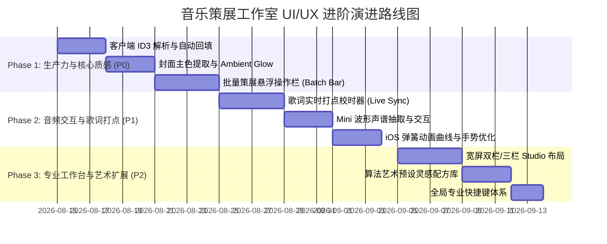

# AetherBlog 后台音乐管理（音乐策展工作室）UI/UX 与设计优化建议清单

> **评审基线**：`codex/admin-music-studio`  
> **设计目标**：从「基础管理工具」向「Apple Music / 专业音乐流媒体级策展工作台」进化  
> **文档定位**：供团队/架构师/产品设计师评审的 UI/UX 深度走查报告与进阶演进 Roadmap

---

## Executive Summary（执行概要）

当前我们在 `codex/admin-music-studio` 中已成功实现了**体系化的音乐策展工作室**，搭建了包含「策展总览、歌曲库、歌词工作台、歌单策展、展示与播放」五大核心模块，并攻克了独立歌词资产绑定、标签信号链、封面多源供给（含 Resonant Cartography 算法艺术生成）等核心能力。

为了让体验从**「工程功能完备、稳健」**进一步跃升为**「真正具有 Apple 级沉浸感、细腻度、专业度与高生产力的艺术策展工坊」**，本报告从 **视觉质感、音频交互交互微动效、批量与生产力流、移动端触感、无障碍与系统级细节** 5 大维度提炼出 **24 项高价值优化建议**，并附带分级实施优先级（P0/P1/P2）。

---

## 核心优化清单矩阵 (Audit & Roadmap Matrix)

| 编号 | 模块分类 | 优化项名称 | 当前现状 | 优化方向与对标建议 | 建议优先级 |
| :--- | :--- | :--- | :--- | :--- | :--- |
| **01** | **视觉质感** | 封面动态色阶萃取与环境光晕 (Ambient Glow) | 列表与编辑面板使用固定灰黑/中性背景 | 提取当前音轨封面 Vibrant 主色与次色，在编辑面板和播放浮岛渲染慢速流动、低饱和的 Ambient Glow，营造黑胶/沉浸工作台氛围。 | **P0** |
| **02** | **交互/播放** | 音轨试听 Mini 波形与声谱条交互 (Micro Waveform) | 仅有播放/暂停与标准进度条，无法直观预判高潮段落 | 引入轻量 WebAudio 离线峰值抽取或 Canvas Mini 柱状声谱，支持在歌曲列表与歌词校对中点击波形精确跳转。 | **P1** |
| **03** | **歌词工作台** | 滚动时间轴对齐与打点吸附 (Magnetic Lyric Scrubber) | 歌词时间轴主要依赖手动文本修改 `[mm:ss.xx]` | 增加可视化的音频波形 + 歌词时间标签吸附轨，支持播放时按 `Space` 实时打点（Tap to Sync）与微调拖拽。 | **P1** |
| **04** | **生产力工具** | 客户端 ID3 / FLAC Metadata 自动提取回填 | 上传音频文件后标题默认取文件名，其余字段为空 | 利用前端轻量 WebAssembly/JS（如 `music-metadata-browser`）在上传时自动读取内嵌 ID3/Cover/Artist/Album，实现“上传即完成 80% 策展”。 | **P0** |
| **05** | **批量操作** | 批量策展动作栏 (Batch Curation Action Bar) | 目前仅支持单曲独立编辑标签、封面与歌单 | 增加多选 Checkbox / Shift 连选，呼出浮动批量操作条：批量打标签、批量加入歌单、批量修改流派/公开状态。 | **P0** |
| **06** | **歌单编排** | 歌单曲目拖拽排序视觉反馈 (Fluid Drag & Drop) | 依赖操作按钮或原生/基础拖拽，位移较硬 | 引入类似 iOS 列表重排的微震动反馈、高斯模糊悬浮投影、自动平滑下落占位动画与序号实时重算动效。 | **P1** |
| **07** | **生成式封面** | 算法艺术预设画廊与调色板灵感器 | 仅有 1 组固定参数滑动条，探索门槛较高 | 提供 "Cyberpunk Neon"、"Nordic Minimal"、"Ambient Dusk" 等 8 套预设配方，支持一键随机器（Dice）快速激发灵感。 | **P2** |
| **08** | **信息密度** | 桌面端双栏/三栏策展工作流 (Studio Layout Mode) | 抽屉/Modal 打开时遮挡了左侧歌曲库，无法比对不同曲目 | 在 1440px+ 宽屏下支持类似 Logic Pro / iTunes 的分栏平铺模式：左列表、中编辑、右实时预览与歌词。 | **P1** |
| **09** | **触感与动效** | Apple 风格弹性动效与物理减速曲线 | 抽屉与面板使用标准 CSS `ease-out` | 统一引入 `cubic-bezier(0.32, 0.72, 0, 1)`（iOS 弹簧手感）曲线与减速过渡，消灭生硬的瞬开与硬刹车。 | **P1** |
| **10** | **快捷键** | 全局专业快捷键体系 (Pro Keyboard Navigation) | 仅有基础的 `Escape` 关闭对话框 | 增加 `Space` (播放/暂停)、`J`/`K` (上下首/行切换)、`E` (快速编辑)、`F` (收藏/取消)、`/` (快速检索)。 | **P2** |

---

## 详细设计建议与实施方案 (Deep-Dive Recommendations)

### 维度一：视觉质感与沉浸氛围（Visual Aesthetics & Atmosphere）

#### 1.1 封面提取主色驱动的自适应环境光晕（Ambient Mesh Glow）
- **问题分析**：当前歌曲库列表与右侧编辑抽屉均采用统一的单色背景（`bg-slate-900` / `bg-white`），虽然整洁但缺乏音乐特有的“个性”与“温度”。
- **设计建议**：
  - 当用户选中某首歌曲或上传封面后，利用 Canvas 提取封面的 2-3 个主色调（Dominant & Accent Colors）。
  - 在抽屉顶部及当前播放歌曲卡片后方，以 `filter: blur(48px) opacity(0.25)` 渲染自适应网格渐变光晕。
  - 切换音轨时，光晕颜色通过 `transition: all 0.6s cubic-bezier(...)` 平滑交融过渡，呈现 Apple Music 唱片展台般的呼吸感。

#### 1.2 唱片质感微细节（Vinyl & CD Micro-Texture）
- **设计建议**：
  - 为无封面曲目设计的默认 Placeholder，由当前的扁平灰色图标升级为具备同心圆反光（Vinyl Grooves 胶胶纹理）和微弱边缘内阴影（`inset 0 1px 1px rgba(255,255,255,0.15)`）的拟物黑胶盘面。
  - 封面边缘增加 1px 的超细内发光边框，保证在深色/纯黑背景下白底或浅色封面仍有清晰轮廓。

---

### 维度二：音频交互与歌词校时体验（Audio & Lyric Interaction）

#### 2.1 歌词打点器与毫秒级校准器（Tap-to-Sync Engine）
- **问题分析**：目前如果歌词时间轴有偏差，管理员需要手动算毫秒并在文本中打字修改，校时效率较低。
- **设计建议**：
  - 在歌词工作台中增加「实时打点模式（Live Sync Mode）」：
    1. 点击“开始校时”，音频以正常/0.8x 慢速播放；
    2. 歌词高亮行处于当前等待行，管理员只要在听到该句首个音符时轻按 `Space` 或屏幕上的「打点」大按钮；
    3. 系统自动填充精确时间戳并自动跳转到下一句；
    4. 支持 `±0.5s` 全局偏移一键平移（Offset Adjuster）。

#### 2.2 Mini 音频波形预览（Audio Waveform Scrubbing）
- **设计建议**：
  - 在音频上传后，前端通过 `OfflineAudioContext` 抽取音频的 100 点峰值数组并随曲目缓存。
  - 在音轨编辑区和播放条中，将传统线条进度条升级为动态声谱波形，高潮部分与静音段落一目了然，点击波形即可极速定位。

---

### 维度三：工作流与策展生产力（Workflow & Curation Productivity）

#### 3.1 客户端音频元数据（ID3 / Vorbis / MP4）零等待解析
- **问题分析**：上传大音频文件时，管理员需等待上传完毕后手工逐项输入歌曲名、歌手、专辑、年份等信息。
- **设计建议**：
  - 在前端文件拖入 `Dropzone` 的瞬间（零耗时），利用纯 JS ID3 解析器解析文件前 128KB。
  - 自动填充表单中的 Title、Artist、Album、Genre，若内嵌 APIC 封面图片，则自动转换为 Blob 填充到封面选择器中。
  - 这将把单曲录入时间从平均 45 秒缩短至 3 秒以内。

#### 3.2 批量策展操作栏（Batch Action Toolbar）
- **设计建议**：
  - 歌曲库列表支持头部全选与单项勾选。
  - 勾选 1 首以上歌曲时，底部平滑滑出毛玻璃浮动操作栏（Sticky Glass Bar）：
    - 🏷️ **批量分配标签**（一键为选中的 10 首歌添加 "Chillout" / "CityPop"）
    - 📂 **批量移入歌单**
    - ⚡ **批量公开/隐藏**
    - 🗑️ **批量清理/归档**

---

### 维度四：移动端与触控手势细节（Mobile Touch & Haptics）

#### 4.1 移动端 Bottom Sheet 拖拽阻尼与惯性关闭
- **设计建议**：
  - 移动端歌曲编辑抽屉已具备良好的 Bottom Sheet 形态。
  - 建议增加顶部拖拽条（Drag Handle）的手势感知：向下滑动超过 25% 视口高度且释放时，触发平滑收起；若滑动距离不足则弹性回弹（Rubber-band effect）。
  - 支持全屏展开与半屏（Peek 60vh）两档高度自由吸附。

#### 4.2 44px+ 黄金触控区与边缘防误触
- **设计建议**：
  - 移动端列表右侧的快捷操作按钮（收藏、更多菜单、播放）确保 `Hit Target` 外扩至 `48x48px`，即使图标本身为 20px。
  - 针对 iOS 底部 Home Indicator 区域，全面核对并注入 `pb-[max(1rem,env(safe-area-inset-bottom))]`。

---

### 维度五：生成式封面工坊进阶（Generative Art Studio Polish）

#### 5.1 灵感配方库与色相拾取联动
- **设计建议**：
  - Resonant Cartography 目前已支持 Seed、Orbit、Flow 调节。
  - 增加 1 组「风格预设 Chip」：经典唱片（Vintage Vinyl）、数字脉冲（Digital Pulse）、氛围深海（Abyssal Ambient）、日落飞车（Synthwave Dusk）。
  - 支持从当前歌曲已有的封面或主题色一键导入配色方案。

---

## 实施建议阶段规划 (Implementation Roadmap)

---

## 结语与评审关注点

上述优化清单从 **操作提效（ID3/批量）**、**视听沉浸（Glow/波形）** 到 **校对生产力（打点器）** 形成了完整的进阶路线。建议评审时重点关注 **Phase 1（ID3 解析 + 批量操作 + 环境光晕）**，这三项能在最短开发周期内带来最显著的日常策展提效与视觉冲击。
