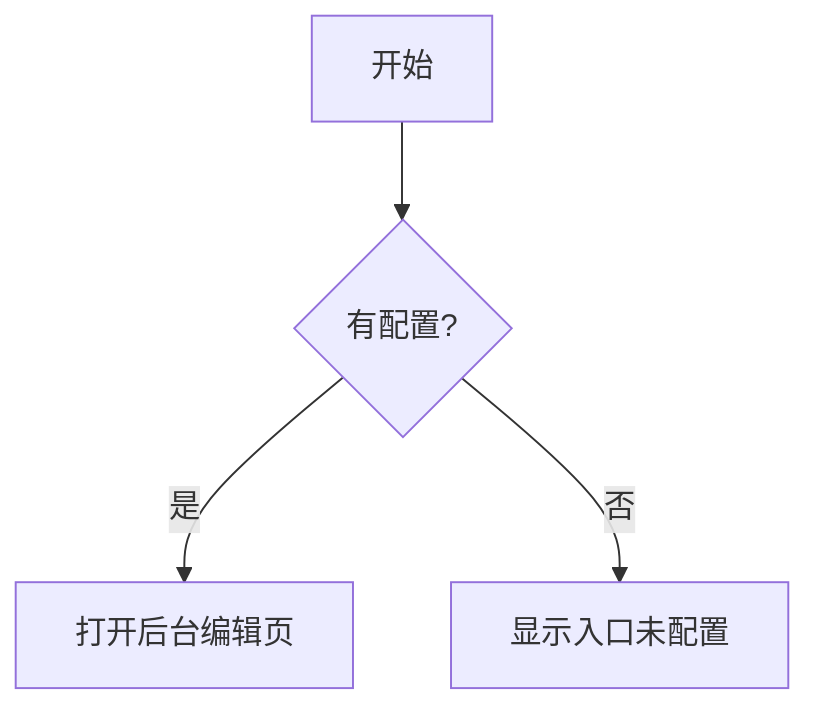

# Markdown 覆盖样例验收页

> 用途：覆盖详情页 Markdown 关键能力，供 `BDA-050/BDA-060` 回归使用。  
> 访问方式：`/posts/__markdown_audit__`

---

## [M-01] GFM 基础（列表、引用、删除线、行内代码）

预期：删除线生效，引用块有左侧高亮边框，列表层级正常，行内代码高亮。

- 普通列表项
- ~~删除线示例~~
- 行内代码：`const answer = 42`

> 这是一个引用块，用于验证 blockquote 样式。

---

## [M-02] 表格（响应式横向滚动）

预期：窄屏下可横向滚动，表头和单元格边框清晰。

| 功能 | 输入 | 预期 |
| --- | --- | --- |
| 表格 | GFM pipe table | 可读、可滚动、不挤压布局 |
| 主题 | 深浅色切换 | 边框/背景对比可辨认 |

---

## [M-03] 任务列表（可访问性）

预期：复选框视觉对齐，`checked` 状态可见；详情页中为只读展示。

- [x] 已完成：补齐复制反馈
- [ ] 待完成：补齐端到端截图归档

---

## [M-04] Heading 锚点（稳定跳转）

预期：标题前出现锚点符号，点击后 URL hash 更新并可回链。

### 锚点测试标题 A

内容 A。

### 锚点测试标题 A

内容 B（重复标题应自动生成不同 id）。

---

## [M-05] Mermaid

预期：语法正确图表可渲染，错误语法展示统一错误态文案。



```mermaid
flowchart TD
  A -->
```

---

## [M-06] KaTeX 数学公式

预期：合法公式渲染，非法公式显示统一错误态。

行内公式：$E = mc^2$

块级公式：

$$
\int_{0}^{\pi} \sin(x)\,dx = 2
$$

错误公式（应显示错误态）：$\frac{1}{ }$。

---

## [M-07] HTML 透传

预期：允许基础 HTML 结构渲染，布局不破坏正文流。

<details>
  <summary>点击展开 HTML 片段</summary>
  <p>这是通过 <code>rehype-raw</code> 渲染的 HTML 内容。</p>
</details>

---

## [M-08] 图片与说明

预期：图片宽度受控，说明文字显示，窄屏不溢出。


---

## [M-09] 链接策略

预期：`http(s)` 外链新窗口打开并带安全属性；站内锚点/相对路径正常。

- 外链（新窗口）：[AetherBlog](https://example.com)
- 站内锚点：[跳转到任务列表](#m-03-任务列表可访问性)
- 相对路径示例：[回到文章列表](/posts)

---

## [M-10] 脚注

预期：脚注可渲染，点击引用和返回链路可用。

脚注引用示例[^regression-note]。

[^regression-note]: 这是脚注正文，回归时需验证跳转与返回。 
